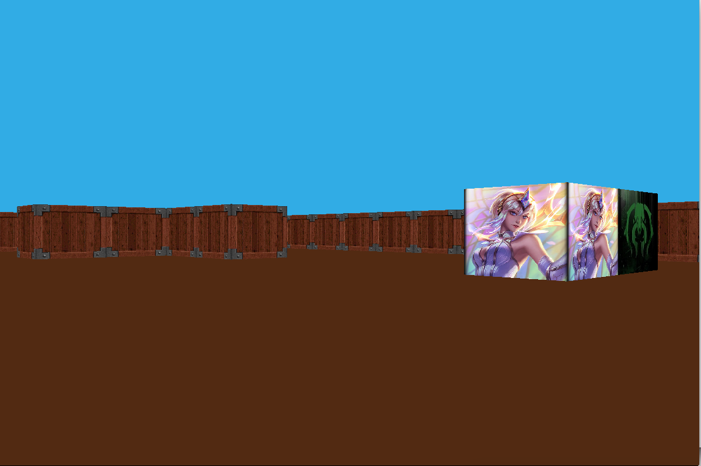
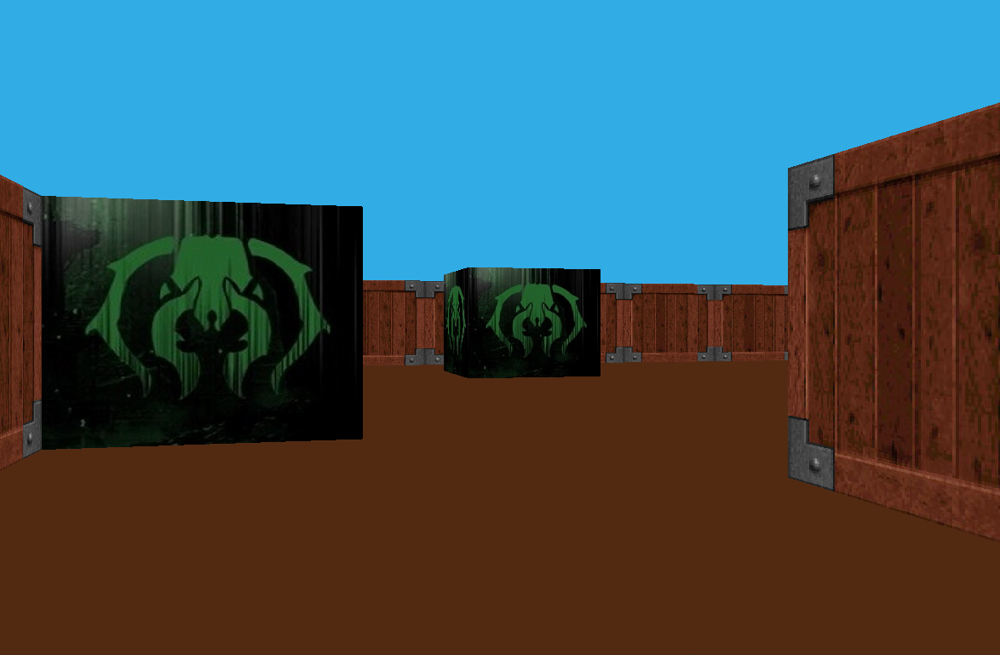
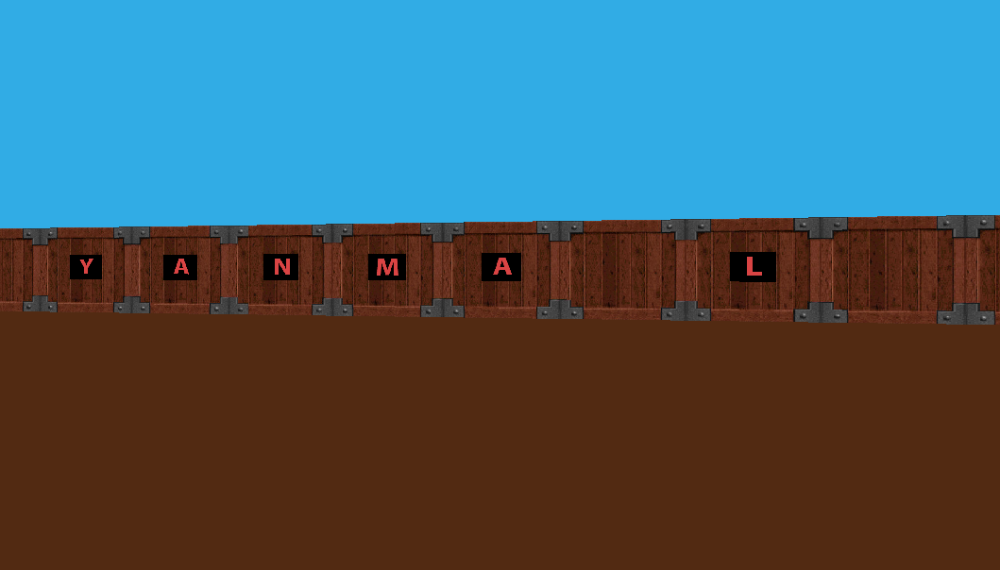
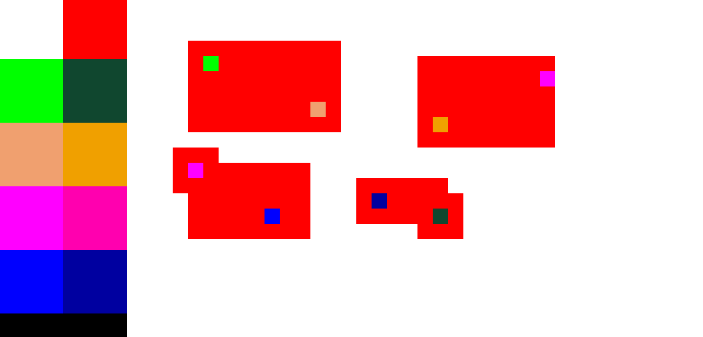

# Wolf3D

Date du projet : 2017/08/25

Projet suspendu pour cause : travail de groupe autre

Troisieme projet de la branche graphique apprenant les bases du raycasting sur un projet assez libre.

## Bases du projet :
Pouvoir se deplacer dans une map cree par le joueur en utilisant le raycating comme sur Wolf3D.

## Option bonus :
principe de teleportation en rentrant dans les block correspondant, texture load avec un parseur bmp fait maison, 
timer pour faire du time attack, mot de passe aleatoire suivant une liste pre-programer permettant d'ouvrir des passages secret,
interface de creation intuitive pour l'utilisateur.

## Option bonus souhaiter :
deux joueur local en ecran spliter, menu pour switcher entre les modes crea/jeux, menu crea plus pousser, leaderboad

